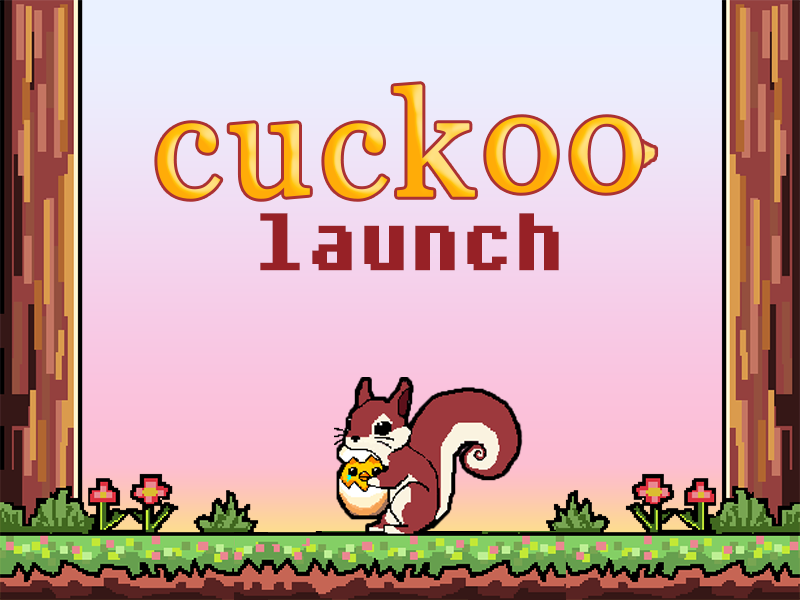
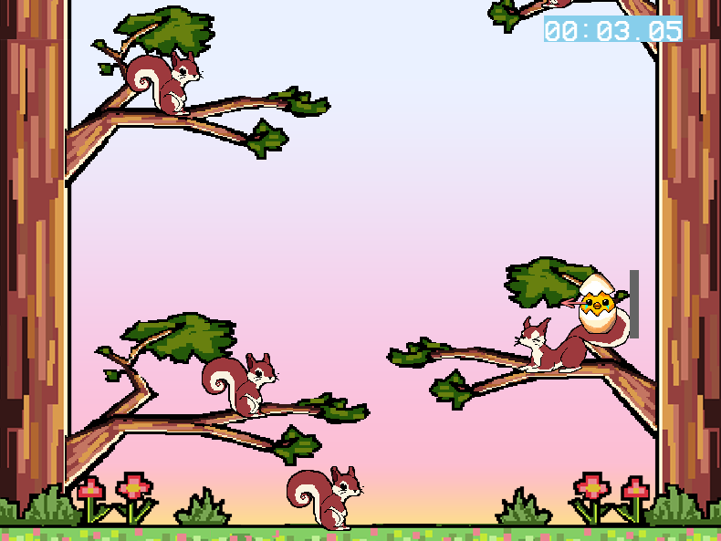

# Cuckoo Launch 🥚

[Play on itch.io!](https://hiden-mau.itch.io/cuckoo-launch)

A game about a little bird that fell out of its nest - but don't worry! The forest friends are ready to help you climb back up. Launch yourself from squirrel to squirrel to reach your nest as fast as possible!

Developed for ScoreSpace Jam #32 by me (code/game design) and my wife (art/game design), with music by morshtalon.

## 🎮 Screenshots





## Technical details

Game created in 3 days following theme "Launch" and requiring scoring.

Built from scratch using C++ with SDL2, and emscriptem for building to web.

The game jam version was written in three days, but some bugs were included that I fixed later. Will not receive anymore updates tho!

## 🛠️ Building from Source

### Prerequisites
- SDL2
- SDL2_image
- SDL2_ttf
- SDL2_mixer
- [Make](https://community.chocolatey.org/packages/make) (for application build)
- [Emscripten](https://emscripten.org/) (for web build - )
- bash (for running the .sh scripts)

### Building the Application

### Clone the repository
```bash 
git clone https://github.com/mauricioohse/cuckoo-launch.git

cd cuckoo-launch
```

### Build using make
```bash 
make help # it will give options for debug, release, web and zip
```

The executable will be created in bin/ folder.

### Building for Web

```bash
# Make sure you have emscripten installed and activated
source path/to/emsdk/emsdk_env.sh  # or emsdk_env.bat on Windows
```
## Build and run using the provided script
```bash
./runweb.sh
```

The web files will be created in the `web/` directory. You can test it by running:

```bash
emrun --no_browser --port 8000 web/
```

Then open `http://localhost:8000` in your browser.

# 🎵 Audio Credits

- Background music: "Launch cucko" by @morshtalon
- Crunch sound: ["eggshells medium"](https://freesound.org/people/IEDLabs/sounds/82318/) by IEDLabs
- Bird chirps: ["Bird, budgie happy chirp 1 to 5"](https://www.zapsplat.com/music/bird-budgie-happy-chirp-5/) by zapsplat
